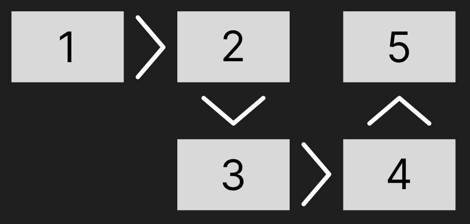

# Проект: Анимация переключения страниц при прокрутке [Открыть пример](https://newj4sus.github.io/Slider-Page/)

Добро пожаловать в проект, который демонстрирует красивую и плавную анимацию переключения между "страницами"! Этот проект идеально подходит для тех, кто хочет добавить интерактивность и визуальную привлекательность в свои веб-приложения. 
К примеру таким подходом можно реализовать анимацию пролистывания книг, какого либо рассказа, и т.д.

## Особенности

- **Плавные переходы**: Анимация переключения страниц происходит плавно и естественно, создавая приятный пользовательский опыт.
- **Гибкость**: Вы можете указать направление перехода с помощью атрибута `data-slide`. Доступные варианты: `left`, `top`, `right`, `bottom`.
- **Наглядная демонстрация**: Для удобства в проекте есть изображение `test.png`, которое показывает, как карточки располагаются в примере.



## Как использовать

1. **Указание направления перехода**: 
   Добавьте атрибут `data-slide` к элементу, который инициирует переход, и укажите желаемое направление:
   ```html
   <div class="card centered" data-slide="right"></div>
   <div class="card centered" data-slide="bottom"></div>
   <div class="card centered"></div>
   ```

   - Первая карточка с data-slide="right" будет при загрузке страницы по середине и явно указывает что вторая карточка будет справа от нее
   - Находясь на второй карточке, data-slide="bottom" указывает что следующая карточка будет ниже (под ней)
